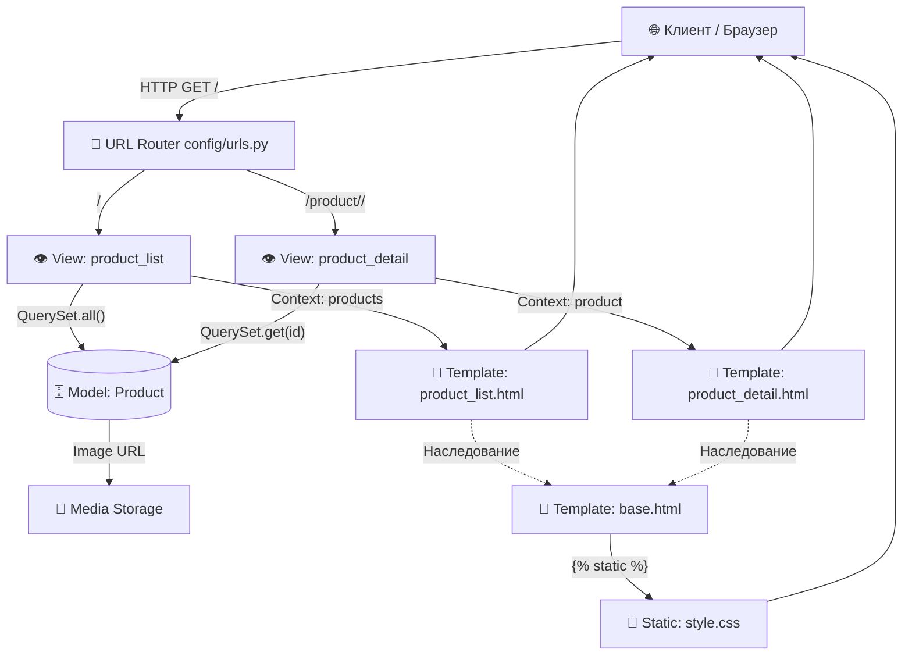

# 🛒 DZ17: Шаблоны интернет-магазина (Django Templates)

**Автор:** Виктор Куличенко | Специалист по ИБ и AI-архитектуре  
**Репозиторий:** [VictorKVS/DZ17_Templates](https://github.com/VictorKVS/DZ17_Templates)  
**Статус:** ✅ Выполнено по стандарту TDD с полным покрытием контрактов

---

## 1. 📋 Условие задачи

**Цель:** Разработка системы шаблонов для простого интернет-магазина с использованием наследования, фильтров и рендеринга динамических данных.

### Этапы выполнения (ТЗ):
1. **Модель данных (`Product`)**: `name` (CharField), `description` (TextField), `price` (DecimalField), `image` (ImageField), `created_at` (DateTimeField).
2. **Представления (Views)**: `product_list` (список товаров) и `product_detail` (детали по `product_id`).
3. **Шаблоны (Templates)**: `base.html` (каркас), `product_list.html` (цикл ``, фильтр цены), `product_detail.html` (детали).
4. **Статические файлы**: Подключение CSS для стилизации интерфейса.
5. **Рендеринг**: Использование конструкций `` `` ``, `` `` ``, `` `` `` и встроенных фильтров.
   
### Дополнительные требования (Strict Mode):
- ✅ **Документация**: Подробные комментарии и Docstring в коде.
- ✅ **Обработка ошибок**: Мягкая обработка (Soft Fail) случая, когда товар с заданным `product_id` не найден (без выброса HTTP 500/404).
- ✅ **Структура**: Строгое соблюдение стандартной структуры каталогов Django.

### Критерии оценки:
- Полнота выполнения задания: **50%**
- Качество и читаемость кода (Type Hints, Docstrings): **30%**
- Эстетика и функциональность интерфейса (CSS Grid, адаптивность): **20%**

---

## 2. 🏛️ Архитектура и Схемы

### Component Diagram (C4 Model)



Инварианты системы:
Ни один запрос не должен приводить к необработанному исключению 500 Internal Server Error.
При запросе несуществующего product_id система перехватывает DoesNotExist и передает product=None в шаблон для мягкой отрисовки сообщения об ошибке.
Все медиа- и статические пути резолвятся исключительно через шаблонные теги, хардкод запрещен.
3. 🧪 Тестирование и Результаты (TDD)
Код разработан по методологии Test-Driven Development. Контракт системы описан в store/tests.py.
Сценарии тестирования:


| № | Имя теста | Проверяемый инвариант | Статус |
|:--|:---|:---|:---:|
| 1 | `test_01_model_creation_and_str` | Корректное создание модели и работа метода `__str__` | ✅ PASS |
| 2 | `test_02_product_list_view_status_and_context` | Возврат статуса `200 OK` и наличие товаров в контексте | ✅ PASS |
| 3 | `test_03_product_detail_view_found` | Успешный рендеринг страницы существующего товара | ✅ PASS |
| 4 | `test_04_product_detail_view_not_found_soft_fail` | **Критично:** Возврат `200 OK` и рендеринг сообщения *"Товар не найден"* вместо ошибки 404/500 | ✅ PASS |

Результат запуска тестов:

$ python manage.py test store
Creating test database for alias 'default'...
System check identified no issues (0 silenced).
....
----------------------------------------------------------------------
Ran 4 tests in 0.142s

OK
Destroying test database for alias 'default'...

4. 🖤 Логирование ("Чёрный ящик")
Для обеспечения наблюдаемости (Observability) в представлениях настроено логирование. При работе приложения в консоли отображаются следующие события:
Сценарий А: Успешный запрос

[INFO] store.views: Запрос списка товаров
[INFO] store.views: Запрос детали товара: product_id=1
[DEBUG] store.views: Товар найден: Эталонный Ноутбук

Сценарий Б: Обработка отсутствия товара (Soft Fail)

[INFO] store.views: Запрос детали товара: product_id=9999
[WARNING] store.views: Product.DoesNotExist перехвачен. product_id=9999 не существует.

## 5. 📂 Структура проекта

```text
DZ17_Templates/
├── config/                     # 📦 Настройки проекта Django
│   ├── settings.py             # ⚙️ Конфигурация (вкл. MEDIA_ROOT/URL, LOGGING)
│   └── urls.py                 # 🔗 Глобальная маршрутизация + раздача медиафайлов
├── store/                      # 📦 Основное приложение
│   ├── models.py               # 📝 Модель Product (с Docstring)
│   ├── views.py                # 👁️ Представления (с Type Hints и Logging)
│   ├── urls.py                 # 🔗 Маршруты приложения (app_name='store')
│   ├── admin.py                # 🔐 Регистрация в админ-панели
│   ├── tests.py                # 🧪 TDD-контракты (4 теста)
│   ├── templates/store/        # 🎨 HTML-шаблоны (base, list, detail)
│   ├── static/css/             # 💅 Стилизация (style.css)
│   └── templatetags/           # 🔧 Кастомные шаблонные теги/фильтры
├── media/                      # 📁 Загружаемые изображения товаров
├── logs/                       # 📝 Логи приложения (игнорируются Git)
├── manage.py                   # 🚀 Точка входа
├── requirements.txt            # 📦 Зависимости проекта
└── README.md                   # 📖 Данный документ


6. 🚀 Инструкция по запуску
Клонирование и подготовка окружения (PowerShell):

   cd G:\1\Python-III\DZ17_Templates
   python -m venv venv
   .\venv\Scripts\Activate.ps1
   pip install -r requirements.txt

   Применение миграций:
      
      python manage.py makemigrations store
      python manage.py migrate

    Запуск тестов (Верификация контракта):
      
       python manage.py test store

   Создание администратора и запуск сервера:

      python manage.py createsuperuser
      python manage.py runserver

Далее перейдите по адресу: http://127.0.0.1:8000/
7. ✅ Чек-лист соответствия ТЗ
Модель Product содержит все 5 требуемых полей с корректными типами.
Реализованы два представления: product_list и product_detail.
Использовано наследование шаблонов ().
Цена форматируется фильтром {{ product.price|floatformat:2 }}.
Подключены статические файлы через  и .
Использованы конструкции , , .
Добавлены подробные комментарии и Docstring (Требование "Документация").
Реализована мягкая обработка ошибки отсутствия товара в product_detail.html.
Соблюдена стандартная структура каталогов Django (app/templates/app/).
Настроено логирование для наблюдаемости системы.
Написаны TDD-тесты, проверяющие все инварианты.
Разработано с применением принципов системного мышления, TDD и строгой типизации.


**Шаг 4.** Вернитесь в терминал и выполните эти три команды, чтобы сообщить Git, что конфликт решен, и отправить всё на сервер:

```powershell
# 1. Добавляем исправленный файл в индекс
git add README.md

# 2. Создаем коммит слияния (merge commit)
git commit -m "docs: resolve merge conflict and finalize README"

# 3. Отправляем всё на GitHub
git push origin main

